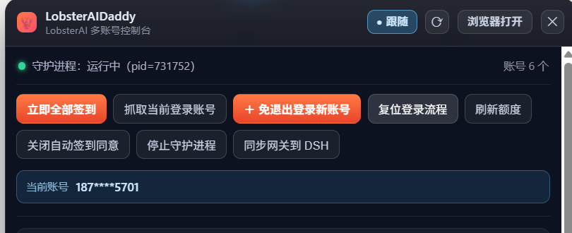
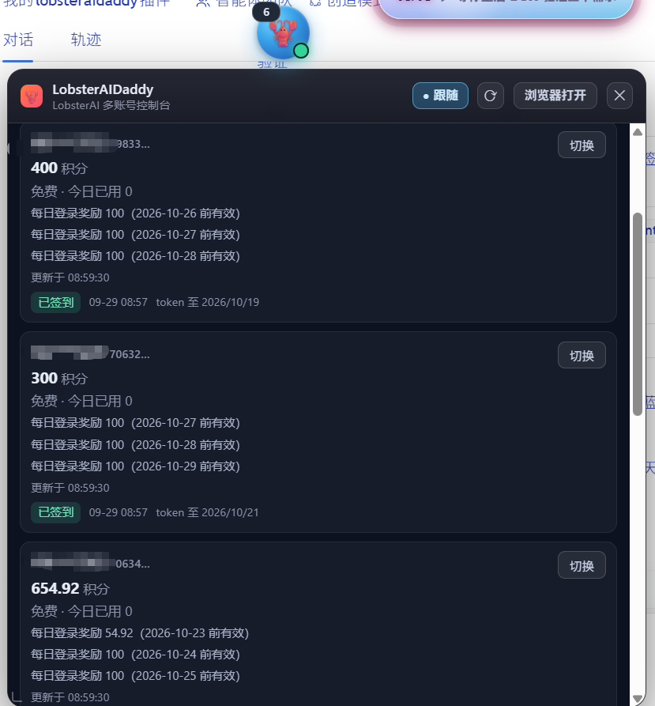

# dsh-lobsterai-daddy · LobsterAIDaddy

把 [LobsterDaddy](https://github.com/loyalchiiina) 多账号控制台变成 **DSH 界面上的悬浮球**：可自由拖拽摆放、位置自动记忆；面板可跟随悬浮球一起移动；点开即以内嵌的原生控制台直接操作账号、签到与切号。

A draggable floating ball that renders the LobsterDaddy multi-account console **as native DOM inside DSH**. Drag it anywhere, let the panel follow it, and manage accounts, check-ins and switching without leaving the harness.

---

## 效果图

### 多账号登录控制台



### 龙虾签到账号



---

## 功能

### 速览

| 能力 | 说明 |
|---|---|
| 🟠 **悬浮球** | 常驻 DSH 界面，可拖到任意位置，坐标自动持久化（重启后原地出现） |
| 🧲 **面板跟随悬浮球** | 拖动悬浮球时面板一起走（相对位置不变）；面板头部也可单独拖动；「跟随 / 固定」一键切换并记忆 |
| 📥 **原生渲染控制台** | 点球展开/收起。抽屉内容自上而下：**操作按钮 → 当前登录账号 → 账号列表 → 运行信息** |
| 👤 **当前登录账号** | 自动读取 LobsterAI 的登录状态并显示昵称；**切号后自动更新**，无需手动抓取 |
| ✅ **签到状态与时间** | 每个账号显示 `已签到 / 今日已签到 / 今日未签到`，并附**最近签到时间** |
| 💰 **积分额度** | 余额、套餐、今日已用、奖励明细（含到期日） |
| 🦞 **免退出并行登录** | 「＋ 免退出登录新账号」扫码加入，账号数无上限 |
| 🔁 **一键操作** | 全部签到 / 复位登录流程 / 刷新额度 / 自动签到开关 / 守护进程开关 / 同步网关到 DSH / 切号 |
| ↔️ **自由调整大小** | 拖动抽屉左下角调整宽高，尺寸自动记忆 |
| 🔴 **实时状态点** | 球右下角圆点：绿=面板在线，灰=未启动 |
| 🔢 **账号数徽标** | 球左上角显示当前账号库数量 |
| 🌐 **浏览器打开兜底** | 头部按钮，由宿主进程**真正**拉起系统浏览器打开完整网页版 |

### 悬浮球与抽屉

- **自由摆放**：按住球拖到屏幕任意位置，松手即记住坐标（存 `localStorage`），重启 DSH 后原地出现。
- **永不越界**：拖拽与窗口缩放都会被夹回可视区内，不会把球拖丢。
- **点击展开**：单击球展开／收起抽屉；**拖拽不会误触发展开**（位移超过 3px 即判定为拖拽）。
- **状态一眼可见**：球右下角圆点绿＝面板在线、灰＝未启动；左上角徽标显示账号库数量。
- **自由缩放**：拖抽屉左下角调整宽高，尺寸独立持久化。

### 面板跟随悬浮球

- **跟随模式**：拖动悬浮球时，已展开的面板按**相同位移**一起移动，相对位置保持不变——球和面板始终保持在你能看到的同一区域。
- **固定模式**：面板钉在原地不动，只移动悬浮球。
- **一键切换**：面板头部「● 跟随 / ○ 固定」按钮，选择被记住，下次打开保持上次的模式。
- **面板可独立拖动**：拖面板标题栏（避开按钮）即可单独挪动面板。
- **位置独立记忆**：面板坐标与悬浮球坐标分开存储，互不干扰；窗口缩放时自动夹回可见区。

### 当前登录账号

- **自动显示**：抽屉里有一行蓝色横幅显示 LobsterAI **当前登录的账号昵称**。
- **无需手动抓取**：插件每次刷新都会重新读取 LobsterAI 自己的登录记录，所以**切号后自动更新**，不用点任何按钮。
- **未登录有提示**：LobsterAI 未登录时显示「LobsterAI 未登录」。
- **安全降级**：读取失败时该行自动隐藏，**不影响账号列表等其它内容**。

> 实现说明：渲染进程无法打开 SQLite，因此由**宿主半边**只读访问 `%APPDATA%\LobsterAI\lobsterai.sqlite` 的 `kv` 表（`auth_tokens` / `auth_user`）并通过 `GET /dsh-lobsterai-daddy/current` 提供。

### 签到状态与最近签到时间

每个账号都会显示今天的状态，并且带**最近一次签到的日期与时间**：

| 状态 | 含义 |
|---|---|
| `已签到` + `09-28 16:21` | 今天签到成功，显示签到时刻 |
| `今日已签到` + 时间 | 今天早些时候已经签过（本次是重复调用，幂等） |
| `今日未签到`（灰） | 今天还没有签到记录 |
| 失败文案（红） | 今天签到时出错，显示面板返回的原因 |

> 日期按面板的跨天判断给出，**过零点自动归为「今日未签到」**，不需要手动清理缓存。

### 账号与积分额度

每个账号卡片显示：

- **账号标识**：昵称／手机号（脱敏）+ uid 短号
- **积分余额**：当前余额（大字突出）
- **套餐信息**：套餐名（如「免费」「会员」）与**今日已用**
- **奖励明细**：最多 3 条奖励条目，含剩余量与到期日
- **更新时刻**：余额缓存的刷新时间
- **Token 有效期**：到期日期，24 小时内到期会显示 ⚠ 提醒

### 一键操作

抽屉顶部提供 8 个操作按钮，全部对应控制台的原始接口：

| 按钮 | 作用 |
|---|---|
| **立即全部签到** | 用账号库里每个账号的 token 逐个签到（需先开启自动签到同意） |
| **抓取当前登录账号** | 把 LobsterAI 当前登录的账号**存入账号库**（与上方「当前账号」显示是两件事） |
| **＋ 免退出登录新账号** | 打开无痕窗口扫码登录，登录后自动入库，**账号数无上限**；不动 LobsterAI App 当前登录状态 |
| **复位登录流程** | 登录卡死时一键解锁，无需重启控制台 |
| **刷新额度** | 重新拉取所有账号的余额／套餐／今日已用 |
| **自动签到开关** | 开启／关闭自动签到同意（未开启时签到按钮为禁用状态） |
| **守护进程开关** | 启动／停止每小时自动 capture + 签到的守护进程 |
| **同步网关到 DSH** | 把当前网关端口与 token 同步进 DSH 配置（切号后已自动同步，此处为手动兜底） |
| **切换**（每个账号行） | 把该账号凭据写回 LobsterAI 并重启 App，切完后网关信息自动同步进 DSH |

- 切换账号会关闭并重启 LobsterAI，因此**保留二次确认**。
- 操作进行中按钮自动置灰，完成后自动刷新列表。
- 登录流程进行中会禁用「＋ 免退出登录新账号」，并提示剩余时间。

### 实时刷新

- 抽屉**打开时**每 15 秒自动刷新一次（与网页控制台同频）。
- 抽屉**关闭时停止轮询**，不占用任何资源。
- 头部 `⟳` 按钮可随时手动刷新。

### 兜底

- **浏览器打开**：由宿主进程**真正**拉起系统浏览器打开完整网页版（`window.open` 在 Electron 沙箱里会被静默拦截，故改为宿主 `spawn`）。
- **面板离线提示**：面板没响应时状态行会提示「正在自动恢复」；机器侧常驻看护每 60 秒巡检，掉线即静默拉起。

> ⚠️ **为什么不用 iframe 嵌网页（v0.3.0 起）**：DSH 桌面端页面运行在 `dsh-app://app` 协议下，该协议**只给顶层框架**发放 `x-dsh-desktop-renderer` 通行证，iframe 作为子框架永远拿不到 → 403 → 空文档；改用绝对 `http://127.0.0.1:port` 又被渲染进程 CSP 拦（实测 `Failed to fetch`）；DSH 还在 `main.js` 里主动禁用了 `webview`。**三条路都封死**，所以控制台改为在抽屉里用**原生 DOM** 绘制，数据经宿主同源代理用 `fetch` 获取（该通道实测可用）。

## 安装

```bash
# 从 npm
dsh plugin --profile desktop add dsh-lobsterai-daddy

# 或从 GitHub
dsh plugin --profile desktop add github:loyalchiiina/dsh-lobsterai-daddy
```

装完**重启 DSH** 生效（客户端 bundle 由宿主启动时加载）。

### 前置：LobsterDaddy 面板

悬浮球只是入口，真正的能力由 LobsterDaddy 提供。面板没起来时先跑：

```bash
node lobster-daddy.js panel --no-browser
```

（默认监听 `127.0.0.1:17819`，仅本机可访问；`--no-browser` 为后台常驻模式，不弹窗口、不开浏览器。）

## 原理

```
DSH 界面
  └─ 悬浮球（client.js，shadow DOM，position:fixed）
       └─ 抽屉 → 原生 DOM 渲染的控制台
            └─ fetch（根相对路径，走客户端 transport）
                 └─ /dsh-lobsterai-daddy/panel/api/*   ← 宿主端同源反向代理
                      └─ http://127.0.0.1:17819          ← LobsterDaddy 网页控制台
```

### 三条硬约束（改代码前必读）

1. **`fetch` 的 URL 必须保持根相对路径**。渲染进程的 CSP **拒绝绝对 loopback 请求**（实测 `relative-fetch status=200` 而 `loopback-fetch FAILED`）。曾把 URL 升级为 `http://127.0.0.1:<port>` 导致抽屉全空，客户端探针里有一条断言专门守这个。
2. **请求侧强制 `accept-encoding: identity`**。代理要往 HTML 里注入 shim 并重算长度，一旦面板返回压缩体而我们又重标了 `content-length`，浏览器会按 gzip 解压一段明文 → **白屏 / 乱码**。拿不到 identity 时**原样透传字节并保留原编码头**，绝不重新标注。
3. **非 `/status`、`/report`、`/current` 的路径全部转发给面板**。控制台自身用绝对路径 `fetch('/api/...')`，shim 会改写成 `/panel/api/...`；若代理只认 `/panel/*` 前缀而对其余路径回 404 JSON，控制台就会报 `刷新失败：Unexpected token 'o', "not found" is not valid JSON`。

### 路由

| 路由 | 用途 |
|---|---|
| `GET /dsh-lobsterai-daddy/status` | 宿主探活 + 面板健康（返回账号**数量**、面板端口） |
| `GET /dsh-lobsterai-daddy/current` | **当前登录账号**：只读 LobsterAI 的 SQLite（`kv` 表 `auth_tokens` / `auth_user`） |
| `GET /dsh-lobsterai-daddy/panel/*` | 面板同源反向代理（含 `/panel/api/*` 全部接口） |
| `GET /dsh-lobsterai-daddy/open` | 由宿主进程拉起系统浏览器打开完整网页版 |
| `POST /dsh-lobsterai-daddy/report` | 客户端诊断上报（写入 `~/.dsh/lobsterai-daddy-client.log`） |

> **为什么 `/current` 由宿主实现**：渲染进程打不开 SQLite。宿主只读打开 LobsterAI 的数据库并返回 `{available, uid, name, reason}`；任何失败都返回 `available:false` 而**不抛错**，绝不拖垮 `/status`。

## 配置

在 profile 的 patch 里可覆盖面板端口：

```yaml
- insert:
    - id: dsh-lobsterai-daddy
      name: dsh-lobsterai-daddy
      config:
        panelPort: 17819
```

## 兼容性

- DSH 桌面端 + 网页端均可用
- 与其它悬浮球插件（`dsh-todo-float-ball` 等）共存，各自独立定位与持久化
- 容器遵循 `position:static + pointer-events:none`，规避 Electron 下 `position:fixed` 子元素偏移问题
- 需要 Node.js ≥ 18；`/current` 依赖 `node:sqlite`（Node 22+ 内置），不可用时自动降级为不显示

## 安全说明

- 面板仅绑定 `127.0.0.1`；**所有插件路由同样只接受回环地址**，非本机请求返回 403
- `/current` 与 `/status` 会读取本机账号信息，因此同样受回环限制
- 不采集、不上传任何数据；账号凭据由 LobsterDaddy 存在本机 `%APPDATA%\LobsterDaddy\accounts`
- ⚠️ 多账号刷积分可能违反 LobsterAI 服务条款，**请只用于自己的账号**，风险自负

## License

MIT
